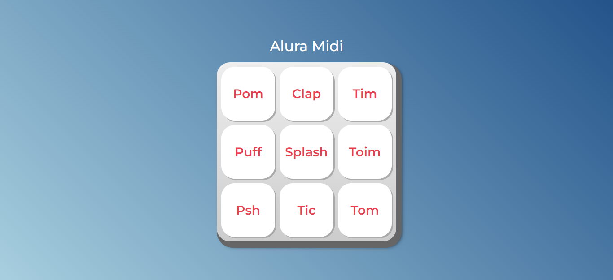

# aluramidi

Projeto criado durante o curso JavaScript para Web: Crie páginas dinâmicas, da Alura, dentro da [formaçao Front-end](https://cursos.alura.com.br/formacao-front-end).

Você pode ver o resultado final [aqui](https://jessicalorenzon.github.io/aluramidi/).

